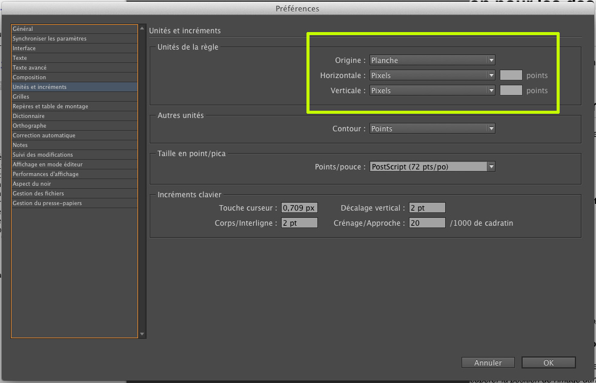
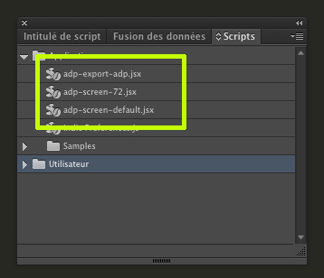
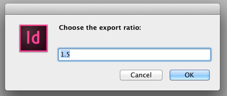
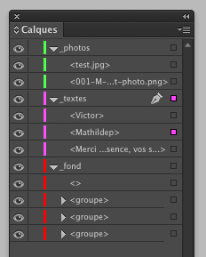
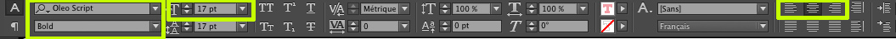
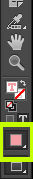
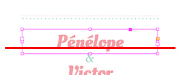
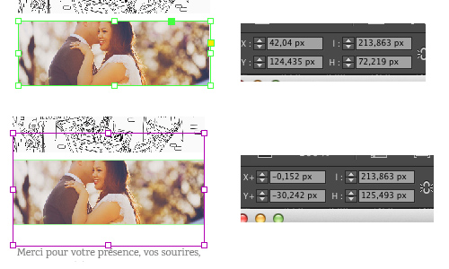

#Spectification pour les designer (WIP)

## Préambule

Le but de ce document est d'expliquer aux designers comment exporter les données d'un document indesign nécessaire à l'application web Art Du Papier.

## Prérequis sur les préférences Indesign

Afin que les données expotées soit cohérentes pour le web, *les unités de la règle* doivent être en pixel.

Un autre point à noter est qu'Indesign affiche par defaut les document par rapport à la resolution de l'ecran ; ce qui à pour conséquence de montrer le document plus grand qu'il n'est réellement (c'est à dire 72 dpi).

Nous vous fornissons 2 scripts spécifique :
- un qui permet d'adapter les préférences au web (resolution à 72 ppi et unités de règle en millimètre)
- un qui permet de reinitialiser les préférences (resolution par défaut et unités de règle en millimètre)

Un troisième script sera fourni qui concerne l'export en lui même.

### Pour installer et utiliser les scripts : 

 * Mettre les fichiers ici: Macintosh HD > Applications > Adobe InDesign CC > Scripts > Scripts Panel
 * Lancer InDesign, créer un nouveau document , et ouvrir le panneau de script (Window > Utilities > Scripts)
 * Pour lancer un script, double-cliquer sur son nom dans le panneau de script 

## Le format des documents

> Comme vu dans les prérequis, la taille du document doit exprimé en pixel

La seul contrainte est que le document doit avoir une **largeur maximum de 920 pixels** avec un ratio d'echelle d'export à 1 (ratio expliqué ci-dessous)

> **Ratio** : le script permet de changer la taille du document à l'export en proposant de spécifier un ratio. Cela peut-être utile pour un document trop grand au trop petit.

>Ici le ratio est 1,5. Par exemple, un document de 300px de large sera exporté avec une largeur 450px.

## La structure à appliquer aux documents

Le document doit comprendre 3 calques :

* pour tous les éléments non-customisable => nom : **_fond**
* pour tous les textes customisables => nom : **_textes**
* pour tous les photos customisables => nom : **_photos**

> NB : Tous les autres calques ne seront pas pris en compte.

##Les éléments non-customisable

Aucune limitation. Le calque sera aplati et transformé en image. 
	
##Les textes customisables

#### les paramètres pris en compte sont encadrés dans l'image suivante :
	
	

	

#### Les contraintes liées aux textes : 
Les contraintes suivantes doivent être suivi pour chaque bloc texte :

* une typo par TextFrame
* une size par TextFrame
* une couleur par TextFrame
* un centrage horizontal par TextFrame
* la hauteur du TexFrame doit comporter un espace supplémentaire en dessous de la dernière ligne correspondant au 1/2 X la taille de la typo en partant de la ligne de base du texte de la dernière ligne (illustré dans l'image ci-dessous)

	
* Les typos doivent être des google font. 
	* La liste exhautive des polices de lettres autorisés est visible ici : et telechargeable en ttf [ici](https://github.com/google/fonts/tree/master/ofl), ici [ici](http://www.fonts.com/web-fonts/google) et visible aussi [ici](http://www.google.com/fonts)
	
## Les photos customisables

#### les paramètres pris en compte sont la taille et la position du container et de l'image.

## Exemple de fichiers indesign *aux normes* téléchargeable à cette adresse : 
	
	

