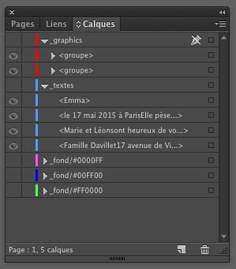

#Spécification pour les designers

## Préambule

Le but de ce document est d'expliquer aux designers comment exporter les données d'un document indesign nécessaire à l'application web Art Du Papier.

## Prérequis sur les préférences Indesign

Afin que les données expotées soient cohérentes pour le web, *les unités de la règle* doivent être en pixel.

Un autre point à noter est qu'Indesign affiche par defaut les documents par rapport à la résolution de l'écran ; ce qui à pour conséquence de montrer le document plus grand qu'il n'est réellement (c'est à dire 72 dpi).

Nous vous fournissons 2 scripts spécifiques à cette adresse : [télécharger ici](http://demo.zeeagency.com/2015/032015/artdupapier/scripts-indesign-web.zip)

- un qui permet d'adapter les préférences au web (résolution à 72 ppi et unités de règle en millimètre)
- un qui permet de reinitialiser les préférences (résolution par défaut et unités de règle en millimètre)

Un troisième script sera fourni qui concerne l'export en lui même.

### Pour installer et utiliser les scripts : 

 * Mettre les fichiers ici : Macintosh HD > Applications > Adobe InDesign CC > Scripts > Scripts Panel
 * Lancer InDesign, créer un nouveau document, et ouvrir le panneau de script (Window > Utilities > Scripts)
 * Pour lancer un script, double-cliquer sur son nom dans le panneau de script 

## Le format des documents

NB : Comme vu dans les prérequis, la taille du document doit être exprimé en pixel

La seul contrainte est que le document doit avoir une **largeur maximum de 920 pixels** avec un ratio d'échelle d'export à 1 (ratio expliqué ci-dessous)

NB : **Ratio** : le script permet de changer la taille du document à l'export en proposant de spécifier un ratio. Cela peut-être utile pour un document trop grand au trop petit.

NB : Ici le ratio est 1,5. Par exemple, un document de 300px de large sera exporté avec une largeur 450px.

## La structure à appliquer aux documents

Le document doit comprendre 1 calque pour les photos customisable, 1 calque pour les textes, n calques pour les différentes versions de fonds (1 calques par version):

* pour tous les versions de fond (éléments non-customisable) => nom : **_fond/#XXXXXX**
	- NB : Les calques (_fond) doivent être postfixé avec la couleur qui les représente 
* pour tous les textes customisables => nom : **_textes**
* pour toutes les photos customisables => nom : **_photos**
* pour toutes les élément graphiques => nom : **_graphics**

NB : Tous les autres calques ne seront pas pris en compte.

## Les fonds (éléments non-customisable)

* Chaque calque représente une version du fond. 

* Les calques devront être nommé selon la nomenclature suivante :
	- _fond/#XXXXXX où #XXXXXX représente la couleur hexadécimal associée.
	- ex. _fond/#FF0000

* Les calques seront aplatis et transformés en image. 
	
## Les textes customisables

#### les paramètres pris en compte sont encadrés dans l'image suivante :
	
	

	

#### Les contraintes liées aux textes : 

Tous les blocs de texte doit avoir une baseline "hauteur des capitales". Pour le faire, selectionnez tous les blocs de textes et &#63743;+B. Une modale s'affiche. selectionnez l'onglet ***option de ligne de base***
puis dans ***premiere ligne de base > decalage***, choisissez ***hauteur des capitales***.

Toutes les typos utilisées doivent être fourni aux formats web : ttf, woff, eot, svg ainsi que le fichier css associé. Pour ce faire, passez par le service [fontie](https://fontie.flowyapps.com/home)

Les contraintes suivantes doivent être suivi pour chaque bloc texte :

* une typo par TextFrame
* une size par TextFrame
* une couleur par TextFrame
* un centrage horizontal par TextFrame
* Option de bloc de texte (selection du bloc de texte => &#63743;+B) > option de ligne de base > premiere ligne de base > decalage : "hauteur des capitales"  
* ~~la hauteur du TexFrame doit comporter un espace supplémentaire en dessous de la dernière ligne correspondant au 1/2 X la taille de la typo en partant de la ligne de base du texte de la dernière ligne (illustré dans l'image ci-dessous)~~

	
* ~~Les typos doivent être des google font. ~~
	* ~~La liste exhautive des polices de lettres autorisés est visible ici : et telechargeable en ttf [ici](https://github.com/google/fonts/tree/master/ofl), ici [ici](http://www.fonts.com/web-fonts/google) et visible aussi [ici](http://www.google.com/fonts)~~
	
## Les photos customisables

#### Les paramètres pris en compte sont la taille et la position du container et de l'image.

## Les éléments graphiques customisables

#### Seul les groupes sont pris en compte. 
* Les éléménts doivent être groupé même s'il n'en n'ont pas besoin. 
* 1 élément customisable = 1 groupe

#### Les paramètres pris en compte sont la position et la dimension du groupe.

NB : les elements seront exportés sous forme de png transparent et feront acte d'élément par défaut

NB : les elements de bibliotèque seront créé manuellement et fourni sous forme d'image png transparent.

## Exemple de fichiers 
###Fichiers indesign *aux normes* téléchargeable à cette adresse : [exemple](http://demo.zeeagency.com/2015/032015/artdupapier/exemple-indesign.zip)
###Fichiers indesign *aux normes* téléchargeable à cette adresse : [exemple2](ftp://artdupapier.dev2013.zeeagency.com/indesign-exemple2.zip)
	
	

